# Expent Database Schema & Architecture Documentation

This document provides a highly detailed breakdown of the internal SeaORM database schema defined in `crates/db/src/entities` and the surrounding architecture that governs it.

In the current architecture, **`crates/db`** serves strictly as a **Data Layer**, containing only SeaORM entities, migrations, and shared types. All high-level "Bank Logic" and business rules have been decoupled into the **`expent_core`** hub.

---

## 1. Architectural Context: The `expent_core` Hub

Unlike standard implementations where business logic might bleed into the database or API layers, Expent utilizes a **Centralized Hub Architecture**:

- **`crates/db` (The State)**: Pure data definitions. No business logic.
- **`crates/expent_core` (The Brain)**: The central hub for all business logic ("Bank Code"). It orchestrates all other crates (`db`, `auth`, `upload`, `ocr`) and exposes granular service modules.

> **Naming note:** `expent_core::services::<x>` paths in this doc describe the **target** layout. The working path today is `expent_core::<x>` (the facade re-exporting the domain crates). See `docs/core.md` for the convention.
- **`apps/api` (The Interface)**: A thin routing layer that delegates all complex operations to `expent_core`.

### Unified Orchestration (`Core` struct)

The system is initialized via `expent_core::Core::init()`, which establishes the database connection and prepares all service clients (S3, OCR, Auth).

---

## 2. Entity Relationship (ER) Diagram

```mermaid
erDiagram
    %% Core Authentication & Users
    USERS ||--o{ ACCOUNTS : "has third-party auth"
    USERS ||--o{ SESSIONS : "authenticates"
    USERS ||--o{ USER_UPI_IDS : "stores upi IDs"

    %% Groups & Contacts
    USERS ||--o{ USER_GROUPS : "belongs to"
    GROUPS ||--o{ USER_GROUPS : "contains"
    USERS ||--o{ CONTACT_LINKS : "saves to address book"
    CONTACTS ||--o{ CONTACT_LINKS : "linked by"
    CONTACTS ||--o{ CONTACT_IDENTIFIERS : "has multiple IDs (upi/phone)"

    %% Transactions
    USERS ||--o{ TRANSACTIONS : "creates"
    TRANSACTIONS ||--o{ TXN_PARTIES : "involves (Sender/Receiver)"
    TXN_PARTIES |o--o| CONTACTS : "links counterparty"
    TRANSACTIONS ||--o| TRANSACTION_METADATA : "has additional info"
    TRANSACTIONS ||--o{ TRANSACTION_SOURCES : "generated from (OCR, Manual, PDF)"
    GROUPS |o--o{ TRANSACTIONS : "includes group expense"

    %% Purchases & Itemization
    TRANSACTIONS ||--o{ PURCHASES : "linked receipt"
    PURCHASES ||--o{ PURCHASE_ITEMS : "receipt line item"

    %% Bank Statements
    BANK_STATEMENT_ROWS ||--o{ STATEMENT_TXN_MATCHES : "confident match"
    TRANSACTIONS ||--o{ STATEMENT_TXN_MATCHES : "matched against row"

    %% Subscriptions
    USERS ||--o{ SUBSCRIPTIONS : "tracks recurring"
    SUBSCRIPTIONS ||--o{ SUBSCRIPTION_CHARGES : "logs historical payments"
    SUBSCRIPTIONS ||--o{ SUB_ALERTS : "configures reminders"

    %% P2P Payments & Ledger
    USERS ||--o{ P2P_REQUESTS : "sends money request"
    TRANSACTIONS |o--o{ P2P_REQUESTS : "links to final settlement"
    TRANSACTIONS ||--o| P2P_TRANSFERS : "has transfer details"
    USERS ||--o{ LEDGER_TABS : "creates tab"

    %% Wallets & Edits
    USERS ||--o{ WALLETS : "owns"
    TRANSACTIONS ||--o{ TRANSACTION_EDITS : "has edit history"

    %% Budgets
    USERS ||--o{ BUDGETS : "sets"
    CATEGORIES ||--o{ BUDGETS : "limited by"

    %% Background Jobs
    USERS |o--o{ BACKGROUND_JOBS : "owns (optional)"
```

---

## 3. Enums Reference

Shared enums are stored as `String(20)` in the database and serialized as `SCREAMING_SNAKE_CASE` in JSON.

| Enum Name              | Values                                                      | Used By                          |
| ---------------------- | ----------------------------------------------------------- | -------------------------------- |
| `TransactionDirection` | `IN`, `OUT`                                                 | `transactions.direction`         |
| `TransactionSource`    | `MANUAL`, `OCR`, `STATEMENT`, `P2P`                         | `transactions.source`            |
| `TransactionStatus`    | `COMPLETED`, `PENDING`, `CANCELLED`                         | `transactions.status`            |
| `IdentifierType`       | `UPI`, `PHONE`, `BANK_ACC`                                  | `contact_identifiers.type`       |
| `TxnPartyRole`         | `SENDER`, `RECEIVER`, `COUNTERPARTY`                        | `txn_parties.role`               |
| `SubscriptionCycle`    | `WEEKLY`, `MONTHLY`, `YEARLY`                               | `subscriptions.cycle`            |
| `BudgetPeriod`         | `WEEKLY`, `MONTHLY`, `YEARLY`                               | `budgets.period`                 |
| `AlertChannel`         | `EMAIL`, `PUSH`                                             | `sub_alerts.channel`             |
| `P2pRequestStatus`     | `PENDING`, `MAPPED`, `REJECTED`, `APPROVED`, `GROUP_INVITE` | `p2p_requests.status`            |
| `GroupRole`            | `ADMIN`, `MEMBER`                                           | `user_groups.role`, `users.role` |
| `WalletType`           | `CASH`, `BANK`, `CREDIT_CARD`, `UPI_WALLET`                 | `wallets.type`                   |
| `LedgerTabType`        | `LENT`, `BORROWED`                                          | `ledger_tabs.tab_type`           |
| `LedgerTabStatus`      | `OPEN`, `PARTIALLY_PAID`, `SETTLED`                         | `ledger_tabs.status`             |

---

## 4. User & Authentication Core

### `users`

- **Purpose**: Identity representation managed by `better-auth` via `crates/auth`.
- **UI Context**: Profile, Side Nav, Settings.
- **Service Hub**: Managed by `expent_core::services::users`.

### `accounts`, `sessions`, `verifications`

- **Purpose**: Backend persistence for `better-auth` plugins (OAuth, Sessions, OTPs).

---

## 5. Transactions & Ledger (The "Bank Logic")

The **`expent_core::services::transactions`** module contains the critical rules for financial integrity.

### `transactions`

- **Automatic Balance Management**: Every `create`, `update`, or `delete` of a transaction triggers the `adjust_transaction_wallets` logic in `expent_core`, ensuring wallet balances stay synced with ledger entries.
- **Split Logic**: The `split_transaction` service handles the fractional P2P distribution of payments.

### `txn_parties`, `transaction_metadata`, `transaction_sources`, `transaction_edits`

- **Audit Trails**: Edits are tracked in `transaction_edits` to preserve history of amount changes.
- **Provenance**: `transaction_sources` links entries back to OCR results or statement rows.

---

## 6. Wallets & Balances

### `wallets`

- **Purpose**: Tracks actual available funds across different account types.
- **Atomic Updates**: All balance changes are handled via `expent_core::services::wallets::utils::adjust_balance` within database transactions to prevent race conditions.

---

## 7. Budgets & Limits

### `budgets`

- **Purpose**: Allows users to set spending ceilings for specific categories or overall.
- **Health Engine**: Data from this table is processed by the `budgets` crate to calculate consumption velocity.

---

## 8. Receipts & Itemization

These tables handle deep item-level logging when the user uploads a shopping receipt.

### `purchases`, `purchase_items`, `purchase_imports`

- **Orchestration**: The **`expent_core::services::ocr`** service manages the pipeline from raw file upload to structured purchase creation.

---

## 8. Subscriptions Management

### `subscriptions`, `subscription_charges`, `sub_alerts`

- **Detection Algorithm**: Recurring patterns are surfaced by an algorithmic pass in **`expent_core::services::subscriptions::detection`**, traversing historical transactions.

---

## 9. Contacts, Split, & P2P

### `contacts`, `contact_identifiers`, `contact_links`

- **Address Book**: Privacy is enforced via `contact_links`, ensuring users only see their own saved contacts.

### `groups`, `user_groups`

- **Collaborative Ledgers**: Role-based access control (RBAC) is implemented in `expent_core::services::groups`.

### `p2p_requests`, `p2p_transfers`, `ledger_tabs`

- **Settlement Orchestration**: P2P request flows, including mirroring transactions upon acceptance, are governed by the `expent_core::services::p2p` module.

---

## 10. Background Jobs & Workers

### `background_jobs`

- **Purpose**: Persists state for asynchronous operations (e.g., OCR processing, generic tasks) managed natively by Rust background workers.
- **Workflow Engine**: Tracks `job_type`, JSON `payload`, retry `attempts` (`max_attempts`), and timestamps (`run_at`, `created_at`, `updated_at`, `started_at`, `completed_at`).
- **Real-Time Integration**: Updates to this table frequently trigger Postgres `LISTEN/NOTIFY` channels (e.g., `ocr_jobs_channel`) for immediate worker ingestion without heavy polling.
